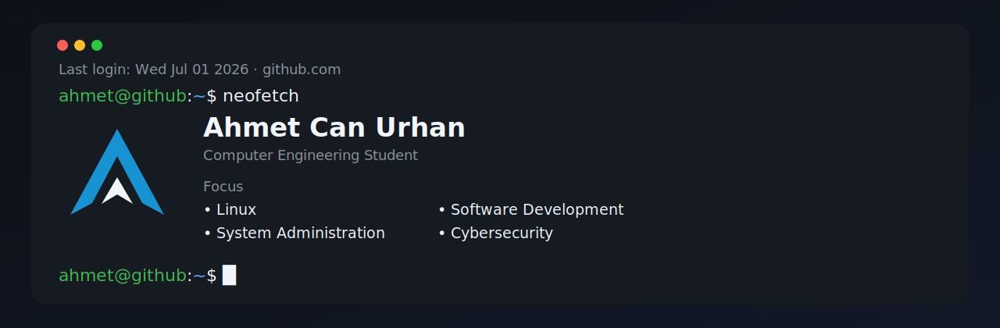

<div align="center">



<br>


</div>

---

```bash
ahmet@github:~$ whoami
```

Computer Engineering student focused on **Linux**, **System Administration**, **Software Development**, and **Cybersecurity**.

I enjoy building practical software, understanding how systems work under the hood, and continuously improving my skills through hands-on projects.

---

```bash
ahmet@github:~$ tree projects
```

```text
projects
├── Gladiator-Last-Stand/
│   ├── Unity
│   ├── C#
│   └── 2D Arena Game
│
├── Hangman Game/
│   ├── C
│   ├── Raylib
│   └── Low-Level Game Development
│
└── Linux-Lab/
    ├── Arch Linux
    ├── Ubuntu Server
    └── Learning Environment (WIP)
```

---

```bash
ahmet@github:~$ cat tech-stack
```

<p align="center">

</p>

---

```bash
ahmet@github:~$ cat roadmap.md
```

```text
[✓] Git & GitHub
[✓] Unity
[✓] Flutter

[>] LPIC-1
[ ] Docker
[ ] Networking
[ ] Kubernetes
```


